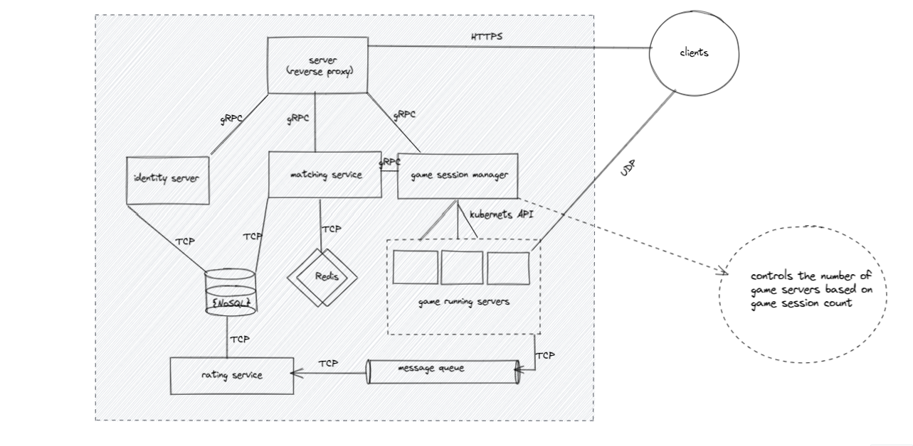

# Vinom  

Vinom is a secure and scalable system designed for managing real-time communication and game matchmaking. It implements a secure protocol using DTLS and provides authentication, user management, and game server communication.  

## System Architecture  
  
Looking at the design, you might ask, "Is all this necessary?" But bear with me—I built this project as a learning experience, and overcomplicating personal projects is a great way to learn.

Let's break down the architecture and explain it.  

### Problem Statement  
I wanted to build a simple game server where communication speed matters. The system should include a rating system and match players based on their rating and network latency. Additionally, I aimed to strengthen my knowledge of distributed systems and microservices.  

### From Problem Statement to a General User Story  
1. A player signs up and then signs in.  
2. They request a match and wait in a matchmaking room.  
3. When another player with a similar rating and latency is found, a game room is created.  
4. Players compete to score more points than their opponent while receiving real-time state updates.  

### From User Story to a List of Services  
1. **Identity Service**  
2. **Matchmaking Service**  
3. **Session Manager**  
4. **Game Service**  
5. **Rating Service**  

## Development Process  
First, I worked on utility logic that was new and challenging for me, such as:  
- A Redis-based matchmaker  
- A secure UDP socket  
- A maze generator  

After that, I developed the system as a monolith using clean architecture. Once the monolith was stable, I migrated to a microservices architecture. This transition was relatively easy because a well-structured clean architecture makes separation straightforward. You can see how I managed the migration by comparing the final monolith version with the current microservices version, both of which are tagged in the repository.  

## Is It Complete?  
No, and that's okay. One piece of advice I received from senior engineers is that for personal projects, you should stop when you feel you've learned what you set out to learn. My goal was to understand microservices, sockets, system design, RPC, Redis, Kubernetes, and RabbitMQ. I believe I've gained solid knowledge in these areas.  

## What’s Left to Do?  
Service communication should be made more reliable, possibly by using **Temporal**.  

## Why Did I Build the Client Side in the Terminal?  
1. I developed the socket manager using Golang, and switching to JavaScript would have been a major headache.  
2. I've been enjoying terminal-based tools, and I thought this would be a good introduction.  

## Where Can We Find Detailed Service Documentation?  
- **Matchmaking Service**: [GitHub](https://github.com/beka-birhanu/vinom-matchmaking)  
- **Session Manager & Game Service**: [GitHub](https://github.com/beka-birhanu/vinom-game-server)  
- **Secure UDP Socket Manager**: [GitHub](https://github.com/beka-birhanu/udp-socket-manager)  
- **Maze Generator**: [GitHub](https://github.com/beka-birhanu/wilson-maze)  

---

Note: Dancing is key.

  
